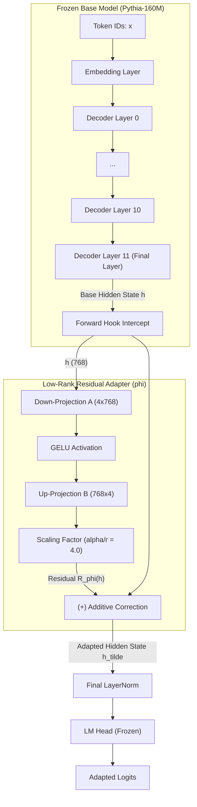
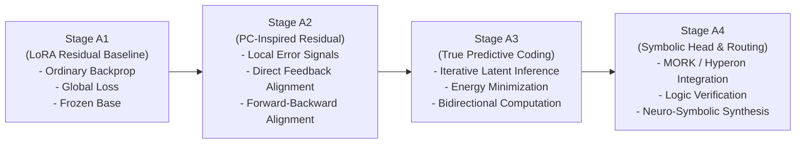

# Stage A1 — LoRA Residual Baseline

Stage A1 implements the **ordinary low-rank residual baseline** for the Neuro-Symbolic LLM research framework. It evaluates the effect of attaching a lightweight, trainable hidden-state residual adapter to a strictly frozen pretrained transformer language model using standard backpropagation and Kullback–Leibler (KL) divergence regularization. Stage A1 introduces **no predictive coding, no latent inference iterations, and no symbolic routing heads**. It serves as the empirical control against which all subsequent neuro-symbolic and predictive-coding architectures (Stages A2, A3, and A4) are measured.

---

## 1. Overview & Research Purpose

### 1.1 What Stage A1 Tests
Stage A1 investigates whether a minimal additive correction applied directly to the intermediate activation space of a frozen language model can improve domain modeling performance while preserving the base model's knowledge and bounding output distribution drift.

### 1.2 Core Research Questions
1. **Capacity & Representation:** What level of next-token prediction improvement can be achieved by learning an additive hidden-state correction $R_\phi(h)$ without modifying any base model weights?
2. **Distributional Stability:** How much does the adapted model's output distribution diverge ($\mathrm{KL}(p_{\text{base}} \parallel p_{\text{adapted}})$) from the base model when regularized with a token-weighted KL penalty?
3. **Parameter & Compute Efficiency:** What are the empirical trade-offs between parameter footprint, inference latency overhead, and task perplexity reduction?

### 1.3 Why A1 Serves as the Baseline
Later stages in this research program introduce:
* **Stage A2:** Predictive-coding-inspired local error updates.
* **Stage A3:** True hierarchical predictive coding with iterative latent inference.
* **Stage A4:** Symbolic memory routing and structured reasoning heads.

To determine whether predictive coding or symbolic augmentation provides genuine architectural benefits—rather than simply providing extra parameters or localized optimization—their empirical performance must be contrasted against an identical frozen backbone with a standard backpropagation-trained residual adapter. Stage A1 establishes this baseline.

---

## 2. Architectural Design & Mechanics

### 2.1 Base Model & Residual Formulation
The Stage A1 model decomposes the adapted language model $F(x)$ into a fixed base model $F_0(x)$ and an activation-space residual correction $R_\phi(x)$:

$$F(x) = F_0(x) + R_\phi(x)$$

* **Base Model ($F_0$):** `EleutherAI/pythia-160m`, a 160-million-parameter decoder-only transformer (GPT-NeoX architecture). All $162{,}322{,}944$ base parameters are frozen (`requires_grad = False`).
* **Hidden State Residual ($R_\phi$):** A low-rank bottleneck module attached via a PyTorch forward hook to the output of a selected transformer layer $l$:

$$\tilde{h}_l = h_l + R_{\phi, l}(h_l)$$

$$R_{\phi, l}(h) = \gamma \cdot B_l \left( \sigma(A_l h) \right)$$

where:
* $h \in \mathbb{R}^{d}$ is the layer's output hidden state ($d = 768$).
* $A_l \in \mathbb{R}^{r \times d}$ is the down-projection matrix (rank $r = 4$).
* $B_l \in \mathbb{R}^{d \times r}$ is the up-projection matrix.
* $\sigma(\cdot)$ is the GELU activation function.
* $\gamma = \frac{\alpha}{r}$ is a fixed scaling factor ($\alpha = 16.0$, so $\gamma = 4.0$ for $r=4$).



### 2.2 Distinction from Standard Weight-Reparameterization LoRA
Stage A1 is **not** standard PEFT LoRA:
* **Standard PEFT LoRA:** Reparameterizes linear weight matrices inside attention or MLP sub-blocks ($W' = W + \Delta W = W + B A$).
* **A1 LoRA Residual:** Operates purely on the **output activation vectors** (hidden states) of transformer blocks via forward hooks ($h \leftarrow h + R_\phi(h)$). The weight matrices of the base transformer are never modified or reparameterized.

### 2.3 Parameter Accounting

| Parameter Component | Status | Parameter Count | Percentage of Total |
| :--- | :--- | :--- | :--- |
| **Base Model ($F_0$)** | Frozen | $162{,}322{,}944$ | $99.9962\%$ |
| **Adapter Down-Projection ($A_{11}$)** | Trainable | $3{,}072$ | $0.0019\%$ |
| **Adapter Up-Projection ($B_{11}$)** | Trainable | $3{,}072$ | $0.0019\%$ |
| **Total Adapter Parameters ($\phi$)** | **Trainable** | **$6{,}144$** | **$0.0038\%$** |
| **Total Model Parameters** | Total | $162{,}329{,}088$ | $100.0000\%$ |

*Note: Adapter linear layers are bias-free ($A \in \mathbb{R}^{4 \times 768}$, $B \in \mathbb{R}^{768 \times 4}$), totaling $4 \times 768 + 768 \times 4 = 6{,}144$ parameters.*

### 2.4 Parameter Initialization & Baseline Equivalence
To guarantee that the adapted model is mathematically identical to the base model at initialization ($t=0$):
* $A$ is initialized using Kaiming uniform initialization ($a = \sqrt{5}$).
* $B$ is initialized to **zeros** ($\mathbf{0}$).
* Therefore, $R_\phi(h) = \mathbf{0}$ at step 0, ensuring $F(x) \equiv F_0(x)$ prior to optimization and setting the initial KL divergence to exactly zero.

---

## 3. Mathematical Formulation & Optimization Objective

### 3.1 Objective Function
The Stage A1 optimization objective is formulated as:

$$\mathcal{L}_{\text{A1}}(\phi) = \mathcal{L}_{\text{task}}(p_{\text{adapted}}, y) + \lambda_{\text{KL}} \cdot \mathrm{D}_{\text{KL}}(p_{\text{base}} \parallel p_{\text{adapted}}) + \lambda_{\text{wd}} \|\phi\|_2^2$$

Where:
1. **Task Loss ($\mathcal{L}_{\text{task}}$):** Cross-entropy loss over shifted next-token predictions:
   $$\mathcal{L}_{\text{task}} = -\frac{1}{N_{\text{valid}}} \sum_{i=1}^{B} \sum_{t=1}^{T-1} \mathbb{I}(y_{i, t+1} \neq -100) \log p_{\text{adapted}}(y_{i, t+1} \mid x_{i, \le t})$$
2. **KL Regularization ($\mathrm{D}_{\text{KL}}$):** Token-weighted Kullback–Leibler divergence between the frozen base distribution $p_{\text{base}}$ and the adapted distribution $p_{\text{adapted}}$:
   $$\mathrm{D}_{\text{KL}}(p_{\text{base}} \parallel p_{\text{adapted}}) = \frac{1}{N_{\text{valid}}} \sum_{i=1}^{B} \sum_{t=1}^{T-1} \mathbb{I}(y_{i, t+1} \neq -100) \sum_{v \in \mathcal{V}} p_{\text{base}}(v \mid x_{i, \le t}) \left[ \log p_{\text{base}}(v \mid x_{i, \le t}) - \log p_{\text{adapted}}(v \mid x_{i, \le t}) \right]$$
3. **Weight Decay Implementation:** To prevent double-counting the $\lambda_{\text{wd}} \|\phi\|_2^2$ penalty, weight decay is decoupled and applied directly within the `AdamW` optimizer ($\text{weight\_decay} = 0.01$), rather than explicitly added to the scalar computation of $\mathcal{L}_{\text{A1}}$.

### 3.2 Dual-Forward Pass Execution
In each training step, two forward passes are performed on each batch:
1. **Base Forward Pass:** Evaluated under `torch.no_grad()` with hooks disabled via `model.adapters_disabled()`, producing detached reference logits $z_{\text{base}}$.
2. **Adapted Forward Pass:** Evaluated with adapter hooks active, producing logits $z_{\text{adapted}}$ that carry gradient computation graphs into the adapter parameters $\phi$.

Base model tensors are strictly detached, ensuring zero gradient flow into $F_0$.

---

## 4. Experimental Setup & Protocol

The configuration for the benchmarked run (`a1_rank4`) is defined in `configs/stage_A/a1_lora_baseline.yaml` with the rank override `adapter.rank=4`.

| Parameter Category | Configuration Parameter | Setting / Value |
| :--- | :--- | :--- |
| **Model** | Base Checkpoint | `EleutherAI/pythia-160m` |
| | Task Type | Causal Language Modeling (`causal_lm`) |
| | Data Type | `float32` |
| | Base Hidden Dimension | $768$ |
| | Base Transformer Layers | $12$ |
| **Adapter** | Adapter Architecture | Low-Rank Hidden Residual (`lora_residual`) |
| | Bottleneck Rank ($r$) | $4$ |
| | Scaling Constant ($\alpha$) | $16.0$ ($\text{scaling} = 4.0$) |
| | Target Layer(s) | `[-1]` (Layer index $11$, final decoder layer) |
| | Activation Function ($\sigma$) | GELU |
| | Dropout | $0.0$ |
| **Data** | Dataset | `wikitext` (`wikitext-2-raw-v1`) |
| | Train / Validation Splits | `train` / `validation` |
| | Text Filtering | Minimum length: $32$ characters |
| | Max Token Length | $256$ tokens (per-batch dynamic collation) |
| | Sample Limits | Train: $4{,}000$ examples; Eval: $256$ examples |
| | Collation & Masking | Dynamic right-padding; padded labels set to $-100$ |
| **Optimization** | Optimizer | `AdamW` ($\text{lr} = 1.0 \times 10^{-3}$, $\beta_1 = 0.9, \beta_2 = 0.999$) |
| | Weight Decay ($\lambda_{\text{wd}}$) | $0.01$ (decoupled via AdamW) |
| | KL Coefficient ($\lambda_{\text{KL}}$) | $0.1$ |
| | Optimization Budget | $200$ optimizer steps ($1$ epoch) |
| | Batch Size / Accumulation | Batch size $8$, Gradient accumulation $1$ |
| | Learning Rate Schedule | Linear warmup ($6\%$ of steps / $12$ steps) + Linear decay to $0$ |
| | Gradient Clipping | Max norm $1.0$ |
| | Seed & Environment | Seed `42`; Device `cpu` (macOS x86_64) |
| **Evaluation** | Evaluation Intervals | Interim validation at step 100, final at step 200 |
| | KL Drift Anchor Set | $8$ validation batches ($64$ examples, $8{,}619$ valid tokens) |
| | Latency Benchmark | Batch size $1$, Sequence length $128$, $3$ warmup + $10$ measured iters |

---

## 5. Empirical Results (`a1_rank4`)

The quantitative results below are drawn directly from the verified experiment run artifacts located at `runs/stage_A/a1/a1_rank4/metrics.json` and `runs/stage_A/a1/a1_rank4/summary.csv`.

### 5.1 Main Evaluation Results

| Metric | BASE (Frozen $F_0$) | A1 Adapted ($F_0 + R_\phi$) | Delta / Change | Interpretation |
| :--- | :--- | :--- | :--- | :--- |
| **Validation Loss** | $3.8260\text{ nats}$ | **$3.7159\text{ nats}$** | **$+0.1101\text{ nats/token}$** | Improved perplexity cross-entropy |
| **Validation Perplexity** | $45.88$ | **$41.10$** | **$-4.78\text{ PPL}$** | $\mathbf{10.42\%}$ relative reduction in perplexity |
| **Trainable Parameters** | $0$ | **$6{,}144$** | **$+0.0038\%$** | Extremely compact parameter footprint |
| **KL Drift ($\mathrm{D}_{\text{KL}}$)** | $0.0000$ | **$0.047924$** | $+0.047924\text{ nats}$ | Bounded, stable predictive distribution shift |
| **Median Inference Latency** | $421.60\text{ ms}$ | $433.91\text{ ms}$ | $+12.31\text{ ms}$ ($+2.92\%$) | Minor forward-hook overhead |
| **Mean Inference Latency** | $404.92\text{ ms}$ | $433.66\text{ ms}$ | $+28.74\text{ ms}$ ($+7.10\%$) | CPU inference execution |
| **Base Parameter Integrity** | Verified | Verified | **NO CHANGE** | Bit-for-bit invariance verified across weights |

### 5.2 Training Dynamics & Convergence

* **Initial Training Loss (Step 1):** $4.0274$
* **Final Training Loss (Step 200):** $3.9047$
* **Interim Validation Loss:**
  * Step 100: Loss = $3.7341$ | Perplexity = $41.85$
  * Step 200: Loss = $3.7159$ | Perplexity = $41.10$
* **Total Training Tokens:** $191{,}319\text{ tokens}$ ($200$ micro-batches)
* **Training Wall-Clock Time:** $5{,}776.9\text{ s}$ ($\approx 96.3\text{ minutes}$ on single-thread CPU)
* **Training Throughput:** $33.12\text{ tokens/second}$ ($0.0346\text{ steps/second}$)

### 5.3 Post-Hoc Adapter Spectral Analysis (SVD)
A singular value decomposition (SVD) was performed on the trained adapter matrices $A_{11}$ and $B_{11}$ ($r=4$):

$$\text{effective\_rank}(S) = \exp\left(-\sum_{i} p_i \log p_i\right), \quad p_i = \frac{s_i}{\sum_j s_j}$$

| Matrix | Dimensions | Frobenius Norm | Spectral Norm ($\sigma_1$) | Singular Values ($s_1, \dots, s_4$) | Effective Rank | Top-1 Energy | Top-2 Energy |
| :--- | :--- | :--- | :--- | :--- | :--- | :--- | :--- |
| **$A_{11}$ (Down)** | $4 \times 768$ | $1.1055$ | $0.5733$ | $[0.573, 0.560, 0.543, 0.534]$ | **$3.998$** | $26.89\%$ | $52.58\%$ |
| **$B_{11}$ (Up)** | $768 \times 4$ | $2.0644$ | $2.0476$ | $[2.048, 0.182, 0.153, 0.112]$ | **$1.943$** | **$98.37\%$** | **$99.15\%$** |

* **Residual Activation Norm:** The mean per-token L2 norm of the residual vector $\|R_\phi(h)\|_2$ across validation sequences is **$2.2149$**.

---

## 6. Interpretation of Results

1. **Parameter Efficiency:** The Stage A1 adapter achieves a **$+0.1101\text{ nats/token}$** improvement in validation loss and drops perplexity from $45.88$ to $41.10$ ($10.42\%$ relative reduction) by updating only **$6{,}144$ parameters** ($0.0038\%$ of the model).
2. **Subspace Concentration in Up-Projection ($B$):** The SVD analysis reveals that while down-projection matrix $A$ preserves full dimensional entropy across all 4 ranks (effective rank $\approx 4.0$), up-projection matrix $B$ strongly collapses its energy into the primary singular direction (**$98.37\%$ of squared singular energy in $\sigma_1$**, effective rank $\approx 1.94$). This suggests that the model primarily uses a 1D or 2D manifold to project the residual correction back into the 768-dimensional hidden state.
3. **Controlled Representation Drift:** The mean KL divergence is $0.0479\text{ nats/token}$ with a max per-token divergence of $1.0525$, confirming that the $\lambda_{\text{KL}} = 0.1$ regularization prevented catastrophic drift from the base model's language modeling distribution.
4. **Latency Overhead:** The adapter hook adds a modest **$+2.92\%$** median latency overhead ($+12.31\text{ ms}$ on CPU for sequence length 128), reflecting the cost of two matrix multiplications and one GELU per sequence token at the final layer.
5. **The Baseline Trade-Off:** Stage A1 proves that backpropagation-trained hidden-state residual adapters offer an effective trade-off: **measurable perplexity reduction + near-zero trainable footprint + small latency overhead**, without compromising base model parameter integrity.

---

## 7. What Stage A1 Does NOT Prove (Limitations)

To maintain scientific rigor, the limitations of the current experiment must be clearly distinguished from its demonstrated results:

* **No Multi-Dataset Generalization:** Results are measured solely on WikiText-2. This does not demonstrate cross-domain robustness, reasoning ability, code generation, or task adaptation beyond this text corpus.
* **Single Seed Evaluation:** The reported run reflects seed `42`. Multi-seed variance and statistical significance testing have not yet been evaluated.
* **Single Rank Point:** This run evaluates rank $r=4$. It does not establish the full rank-scaling behavior or compute the cross-rank residual compressibility metric $C_{\text{resid}}(D)$ (which requires comparing $r=4, 8, 16$).
* **Model Scale:** The base model is Pythia-160M. Performance at 1B–70B parameter scales cannot be inferred from these results.
* **Single Target Layer:** The adapter was hooked exclusively to the final decoder layer (`[-1]`). Multi-layer insertion or middle-layer adaptation dynamics were not tested.
* **No Evaluation of Neuro-Symbolic Mechanics:** Stage A1 is strictly an ordinary neural baseline. It does not test predictive coding, credit assignment without global backpropagation, symbolic knowledge retrieval, or logic constraint satisfaction.

---

## 8. Reproducibility Guide

### 8.1 Environment Setup
The environment requires Python $\ge 3.10$ with PyTorch and Hugging Face Transformers. Dependencies are managed via `pyproject.toml`.

```bash
# Create and activate a virtual environment
python3 -m venv .venv
source .venv/bin/activate

# Install project dependencies in editable mode
pip install -e ".[dev]"
```

### 8.2 Reproducing the Reported `a1_rank4` Experiment
Execute the Stage A1 experiment runner using the exact command:

```bash
python experiments/run_stage_a1.py \
    --config configs/stage_A/a1_lora_baseline.yaml \
    --set adapter.rank=4 \
    --set output.run_name=a1_rank4
```

### 8.3 Executing Fast Pipeline Smoke Tests
To verify pipeline integrity, parameter freezing assertions, and metric logging without downloading external checkpoints:

```bash
# Run standalone smoke test runner
python experiments/run_stage_a1.py --config configs/stage_A/a1_smoke.yaml --smoke

# Run the complete test suite
pytest tests/unit/
```

---

## 9. Output Artifacts Directory Structure

Successful runs generate an output bundle under `runs/stage_A/a1/<run_name>/`:

```text
runs/stage_A/a1/a1_rank4/
├── adapter.pt            # Serialized PyTorch checkpoint of adapter weights only (6,144 parameters)
├── metrics.json          # Machine-readable JSON containing all parameters, metrics, SVD, and latency data
├── summary.csv           # Single-row CSV summary of top-level performance indicators
└── training_steps.csv    # Step-by-step optimization logs (loss, task loss, KL, learning rate, norms)
```

### Artifact Schema Breakdown
* **`adapter.pt`:** Contains `adapter_state_dict` (only keys `11.A.weight` and `11.B.weight`), target layer indices (`[11]`), hidden dimension (`768`), and configuration metadata. Does not store base model weights.
* **`metrics.json`:** Comprehensive JSON dump including hardware details, full configuration, parameter accounting, BASE vs A1 evaluation metrics, KL drift statistics, latency percentiles (min, median, mean, p95, max), SVD singular values, and parameter freezing audit flags (`base_parameters_changed: false`).
* **`training_steps.csv`:** Detailed log of all $200$ steps recording `loss`, `task_loss`, `kl`, `weighted_kl`, `learning_rate`, `adapter_l2_squared`, and `num_valid_tokens`.

---

## 10. Relation to Subsequent Project Stages



* **Stage A1 (Current):** Validates the baseline capability of hidden-state residual adapters using conventional end-to-end backpropagation.
* **Stage A2 (Next):** Replaces end-to-end backpropagation through the base model graph with predictive-coding-inspired local error updates and feedback alignment.
* **Stage A3:** Implements true predictive coding with dynamic settling iterations and layerwise energy minimization.
* **Stage A4:** Integrates symbolic query routing, structured memory, and discrete constraint verification.

Stage A1 provides the empirical benchmark against which the representations, compressibility ($C_{\text{resid}}$), retention, and computational trade-offs of Stages A2–A4 will be rigorously compared.
